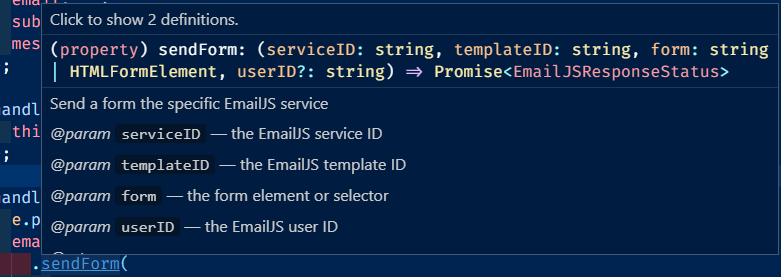

# Contact Form with EmailJS

Create a simple React contact form with real time email handler using using third-party service EmailJS. EmailJS allows you to send email directly from your client-side Javascript code. It's free package includes:

    200 monthly requests
    2 email templates
    Requests up to 50Kb
    Limited contacts history

Let's get started.

### Step 1: Creating an EmailJS account

Go to https://www.emailjs.com/ and create an account. For a portfolio usage the free account plan is more than enough, you will get roughly 200 emails monthly.

### Step 2: EmailJS configuration

Once your account is created, you will need to configure an email service as well as a email template to organize the content that will come from your react-form.

##### Select an Email provider

- Click on `Email Services`, If necessary click on the button `Add new service`
- Select an email service provider that will manage your account. In my case I choose gmail.
- Click on `connect account` and allow emailJS to send emails on your behalf, follow the prompts until it is configure.

##### Build your email Template

- Inside the `Email Template` tab click on `Create new template`
- The parameter coming from your form must be surround in double curly braces
- Example:
-

```
   <input
        name="firstName"
        type="text"
      />

       <input
        name="lastName"
        type="text"
      />

```

So the template would contain `{{firstName}}` and `{{lastName}}`

##### My template:

Subject: `Message From your Portfolio`

Content:

```
Hello Bruninho,

You got a new message:

    User Info:

        Name: {{name}}

        Email: {{email}}


    Message:

        Subject:  {{subject}}

        {{{message}}}


Best wishes,
From your Portfolio
```

#### React Form Component

For my contact form component I have added two dependencies the EmailJS and FontAwesome

- Install EmailJS dependency by running `npm install emailjs-com --save`
- (Optional) I also added FontAwesome to display an icon for the required field
  `npm i --save @fortawesome/free-brands-svg-icons @fortawesome/free-solid-svg-icons @fortawesome/react-fontawesome` `npm i @fortawesome/fontawesome-svg-core`
- Create a file called Contact.js (or whatever you want to call it). This will be a class base component that will hold our contact form

```
import React, { Component } from 'react';

class Contact extends Component {
    render() {
        return (
            <div>
            <h1> Contact Form</h1>

            </div>
        );
    }
}

export default Contact;

```

##### Import FontAwesome and emailjs to your

```
import emailjs from "emailjs-com";
import { FontAwesomeIcon } from "@fortawesome/react-fontawesome";
import { faCircle } from "@fortawesome/free-solid-svg-icons";

```

##### Now, let's add the JSX for the form and it's style in the index.css

JSX: Contact.js

```
 <section id="contactme">
        <h1 className="contact-title">Say Olá</h1>
        <div className="wrapper-contact">
          <div className="contact ">
            {this.state.messageSent ? (
              <div className="alert animated fadeInUp">
                Your Message has been sent
              </div>
            ) : (
              ""
            )}

            <form

              className="animated delay-1s fadeInRight"
              id="contactForm"
            >
              <p>
                <input
                  name="name"
                  type="text"
                  placeholder="Full Name"
                  id="form-name"
                  required
                  value={this.state.name}

                />
                <span className="required">
                  <FontAwesomeIcon icon={faCircle} />
                </span>
              </p>
              <br />
              <p>
                <input
                  name="email"
                  type="email"
                  placeholder="E-mail Address"
                  id="form-email"
                  required
                  value={this.state.email}

                />
                <span className="required">
                  <FontAwesomeIcon icon={faCircle} />
                </span>
              </p>
              <br />
              <p>
                <input
                  name="subject"
                  type="text"
                  placeholder="Subject"
                  id="form-subject"
                  value={this.state.subject}

                />
              </p>
              <p>
                <textarea
                  name="message"
                  type="text"
                  placeholder="Message"
                  value={this.state.message}

                  rows="4"
                  id="form-message"
                  required
                ></textarea>
                <span className="required">
                  <FontAwesomeIcon icon={faCircle} />
                </span>
              </p>
              <br />
              <p id="btn-form">
                <input
                  type="submit"
                  name="submit"
                />
              </p>
              <br />
            </form>
          </div>
        </div>
      </section>
```

<details><summary>Style: index.css</summary>

```
@import url("https://fonts.googleapis.com/css2?family=Open+Sans:wght@300&display=swap");
@import url("https://fonts.googleapis.com/css2?family=Archivo+Black&display=swap");

:root {
  --main-light-gray-bg: #eaecef;
  --title-light-gray-color: #9e9d9d;
  --title-dark-gray-color: #545454;
  --gold-highlight-color: #fca311;
  --dark-mode-bg: linear-gradient(to top left, #000000, #545454);
  --light-mode-bg: linear-gradient(to top left, #ffffff, #cfd2d6) !important;
  --background: var(--light-mode-bg);
  --foreground: var(--title-dark-gray-color);
}

/*=======================================
==> General Dark and Light Mode classes
=========================================*/

html,
body {
  width: 100%;
  margin: 0;
  padding: 0;
}

body {
  font-family: "Open Sans", sans-serif;
  background: var(--background);
  -webkit-touch-callout: none;
  cursor: default;
  -webkit-user-select: none;
  -moz-user-select: -moz-none;
  -ms-user-select: none;
  user-select: none;
}

#root {
  overflow: hidden !important;
  overflow-y: hidden !important;
  overflow-x: hidden !important;
  margin: 0;
  padding: 0;
  width: 99.9%;
  height: 100vh;
  will-change: transform, opacity;
}

/*------------------------
=> Contact Page
--------------------------*/
#contactme {
  margin: 3rem;
  padding: 3rem;
  display: flex;
  justify-content: space-evenly;
  align-items: center;
  width: 80vw;
}
.contact-title {
  font-size: 7rem;
  text-transform: uppercase;
  margin: 0 !important;
  letter-spacing: 0.2rem;
  color: var(--title-dark-gray-color);
}
.contact-title::after {
  content: "";
  max-width: 30vw;
  height: 1px !important;
  background: #dd9116b6;
  border-radius: 1rem;
  display: block;
  padding: 0.7rem;
  z-index: -1;
  margin-top: -2.9rem;
  margin-left: 0rem;
}

.wrapper-contact {
  display: grid;
  grid-template-columns: 1fr !important;
  max-width: 70%;
  text-align: center;
  box-shadow: 0 10px 20px rgba(0, 0, 0, 0.19), 0 6px 6px rgba(0, 0, 0, 0.23);
}

.contact {
  background: #ffffff;
  width: 25vw;
  padding: 1rem;
}
.contact form {
  display: grid;
  grid-template-columns: 1fr;
  grid-gap: 1px;
  background-color: transparent;
}
.contact form input,
.contact form textarea {
  width: 70%;
  padding: 1rem;
  border: none;
  outline: none;
  background: transparent;
  border-bottom: 1px solid var(--foreground);
  color: var(--foreground);
}

#btn-form input {
  border: none;
  width: 30%;
  height: auto;
  padding: 1rem;
  background: var(--title-light-gray-color);
  color: var(--main-light-gray-bg);
  border: none;
  text-transform: uppercase;
  letter-spacing: 0.1rem;
  transition: ease-in-out 0.5s;
}

#btn-form input:hover {
  cursor: pointer;
  color: var(--dark-mode-bg) !important;
}

.alert {
  text-align: center;
  padding: 10px;
  font-size: 1.2rem;
  font-weight: 600;
  background: var(--title-light-gray-color);
  color: var(--main-light-gray-bg);
  border-radius: 0 3rem 0 3rem;
}

.required {
  color: #f71212d5;
  font-size: 6px;
  margin-left: 0.3rem;
}

#divID {
  width: 100%;
  height: 100%;
  display: flex;
  flex-direction: column;
  justify-content: center;
  align-items: center;
}
.home-logo-p:hover {
  cursor: -moz-grab;
  cursor: grab;
}

.side-drawer,
.backdrop,
.toggle-button,
.side-draw-button {
  display: none;
}

/*
=======================================
==>        Animations
=========================================
*/

.animated {
  -webkit-animation-duration: 1s;
  animation-duration: 1s;
  -webkit-animation-fill-mode: both;
  animation-fill-mode: both;
}

.fadeInRight {
  -webkit-animation-name: fadeInRight;
  animation-name: fadeInRight;
}
.fadeInLeft {
  -webkit-animation-name: fadeInLeft;
  animation-name: fadeInLeft;
}

/************************
=       Fade Right
*************************/
@-webkit-keyframes fadeInRight {
  from {
    opacity: 0;
    /*-webkit-transform: translate3d(100%, 0, 0);
    transform: translate3d(100%, 0, 0);*/
    -webkit-transform: translate3d(50px, 0, 0);
    transform: translate3d(50px, 0, 0);
  }

  to {
    opacity: 1;
    -webkit-transform: none;
    transform: none;
  }
}

@keyframes fadeInRight {
  from {
    opacity: 0;
    /*-webkit-transform: translate3d(100%, 0, 0);
    transform: translate3d(100%, 0, 0);*/
    -webkit-transform: translate3d(50px, 0, 0);
    transform: translate3d(50px, 0, 0);
  }

  to {
    opacity: 1;
    -webkit-transform: none;
    transform: none;
  }
}

/************************
=       Fade Left
*************************/
@-webkit-keyframes fadeInLeft {
  from {
    opacity: 0;
    /*-webkit-transform: translate3d(-100%, 0, 0);
    transform: translate3d(-100%, 0, 0);*/
    -webkit-transform: translate3d(-50px, 0, 0);
    transform: translate3d(-50px, 0, 0);
  }

  to {
    opacity: 1;
    -webkit-transform: none;
    transform: none;
  }
}

@keyframes fadeInLeft {
  from {
    opacity: 0;
    /*-webkit-transform: translate3d(-100%, 0, 0);
    transform: translate3d(-100%, 0, 0);*/
    -webkit-transform: translate3d(-50px, 0, 0);
    transform: translate3d(-50px, 0, 0);
  }

  to {
    opacity: 1;
    -webkit-transform: none;
    transform: none;
  }
}


/*
=======================================
==>        END-Animations
=======================================
*/
```

</details>

#### Let's add the state

I am adding to the state name, email, subject, and message value assigning an empty string to them.

```
state = {
    messageSent: false,
    name: "",
    email: "",
    subject: "",
    message: "",
  };
```

#### Add value and name attributes

Add a value attribute to your form input so we assign it to the state

`value={this.state.message}`

Add a name attribute to your inputs so it can handle change

`name="name", name="email", name="subject", name="message"`

#### Next, I will add the handleChange method

Simply, create a `handleChange` method that will set the state value name to whatever value is coming from your form by stating `this.setState({ [e.target.name]: [e.target.value] });`

```
  handleChange = (e) => {
    this.setState({ [e.target.name]: [e.target.value] });
  };
```

Add the handleChange Method to your form's inputs name, email, subject, and text
`onChange={this.handleChange}`

#### Create the submit handler and connect to EmailJS

According to EmailJS's documentation we are using their sendForm() method that takes four parameters

- EmailJS Service ID
  - "gmail"
- EmailJS Template ID
  - "my-portfolio-contact-page"
- Element or selector of the form (Class or ID)
  - .contact-form #contactForm
- EmailJS User ID
  - Go to Account >> API Keys
  - user_blablaOwC88fGfGfahg

## 

This method can take promises and any error can be handled by catch(). After that set the state to empty strings so you can clear out the form.

```
handleSubmit = (e) => {
e.preventDefault();
emailjs
.sendForm(
"gmail",
"bruno_portfolio_message",
"#contactForm",
"user_oyLJWpa6rPOwCCyxCKMdJ"
)
.then()
.catch();

    this.setState({
      name: "",
      email: "",
      subject: "",
      message: "",
      messageSent: true,
    });

};

```

<details><summary>Final Contact Form Component</summary>

```
import React, { Component } from "react";
import emailjs from "emailjs-com";
import { FontAwesomeIcon } from "@fortawesome/react-fontawesome";
import { faCircle } from "@fortawesome/free-solid-svg-icons";

class Contact extends Component {
state = {
messageSent: false,
name: "",
email: "",
subject: "",
message: "",
};

handleChange = (e) => {
this.setState({ [e.target.name]: [e.target.value] });
};

handleSubmit = (e) => {
e.preventDefault();
emailjs
.sendForm(
"gmail",
"bruno_portfolio_message",
"#contactForm",
"user_oyLJWpa6rPOwCCyxCKMdJ"
)
.then()
.catch();

    this.setState({
      name: "",
      email: "",
      subject: "",
      message: "",
      messageSent: true,
    });

};

render() {
return (

<section id="contactme">
<h1 className="contact-title">Say Olá</h1>
<div className="wrapper-contact">
<div className="contact ">
{this.state.messageSent ? (
<div className="alert animated fadeInUp">
Your Message has been sent
</div>
) : (
""
)}

            <form
              onSubmit={this.handleSubmit}
              className="animated delay-1s fadeInRight"
              id="contactForm"
            >
              <p>
                <input
                  name="name"
                  type="text"
                  placeholder="Full Name"
                  id="form-name"
                  required
                  value={this.state.name}
                  onChange={this.handleChange}
                />
                <span className="required">
                  <FontAwesomeIcon icon={faCircle} />
                </span>
              </p>
              <br />
              <p>
                <input
                  name="email"
                  type="email"
                  placeholder="E-mail Address"
                  id="form-email"
                  required
                  value={this.state.email}
                  onChange={this.handleChange}
                />
                <span className="required">
                  <FontAwesomeIcon icon={faCircle} />
                </span>
              </p>
              <br />
              <p>
                <input
                  name="subject"
                  type="text"
                  placeholder="Subject"
                  id="form-subject"
                  value={this.state.subject}
                  onChange={this.handleChange}
                />
              </p>
              <p>
                <textarea
                  name="message"
                  type="text"
                  placeholder="Message"
                  value={this.state.message}
                  onChange={this.handleChange}
                  rows="4"
                  id="form-message"
                  required
                ></textarea>
                <span className="required">
                  <FontAwesomeIcon icon={faCircle} />
                </span>
              </p>
              <br />
              <p id="btn-form">
                <input
                  onClick={this.successMessage}
                  type="submit"
                  name="submit"
                />
              </p>
              <br />
            </form>
          </div>
        </div>
      </section>
    );

}
}

export default Contact;

```

</details>
```
